# Análisis de Casos de Uso - Jorgestor

---
### 📂 Navegación del Repositorio
[**🏠 Inicio**](../../README.md) | [**🎨 Diseño**](../diseño) | [**💻 Desarrollo**](../../src)
---

Esta carpeta contiene la documentación detallada del análisis de los casos de uso del sistema **Jorgestor**. Cada subdirectorio corresponde a un caso de uso específico y contiene su análisis funcional.

## Diagramas de Colaboración (Análisis)

A continuación se presentan los diagramas de colaboración resultantes del análisis de cada caso de uso, organizados por módulos funcionales.

### 🔐 Gestión de Sesión
Permite el acceso seguro al sistema y la finalización de la jornada de trabajo.

| Inicio de Sesión | Cerrar Sesión |
| :---: | :---: |
| 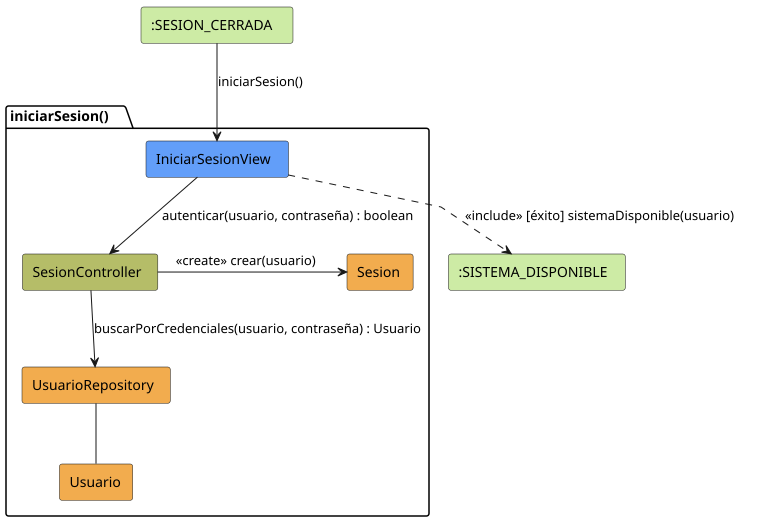 | 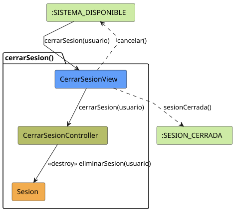 |

---

### 📊 Dashboard y Navegación
Punto central de entrada tras el login que orquesta las opciones disponibles según el perfil.

| Completar Gestión |
| :---: |
|  |

---

### 🎓 Gestión de Grados
Administración de los niveles académicos o grupos de alumnos.

| Ver Grados | Crear Grado |
| :---: | :---: |
|  |  |

| Editar Grado | Eliminar Grado |
| :---: | :---: |
| 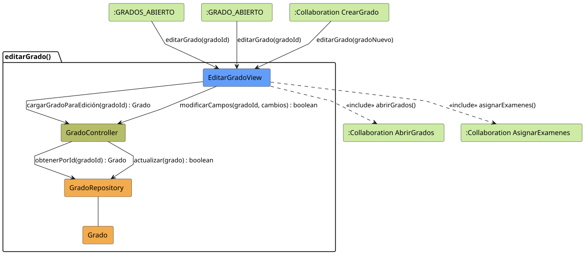 | 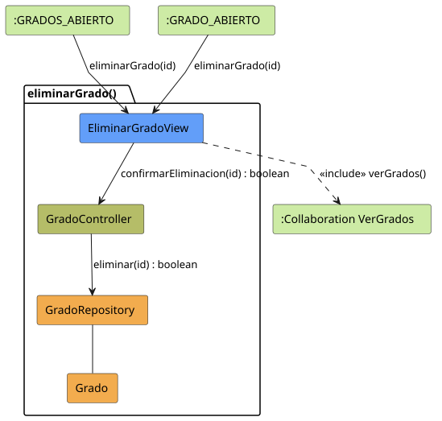 |

---

### 📚 Gestión de Asignaturas
Configuración de las materias impartidas y su vinculación con grados.

| Ver Asignaturas | Crear Asignatura |
| :---: | :---: |
|  |  |

| Editar Asignatura | Eliminar Asignatura |
| :---: | :---: |
| 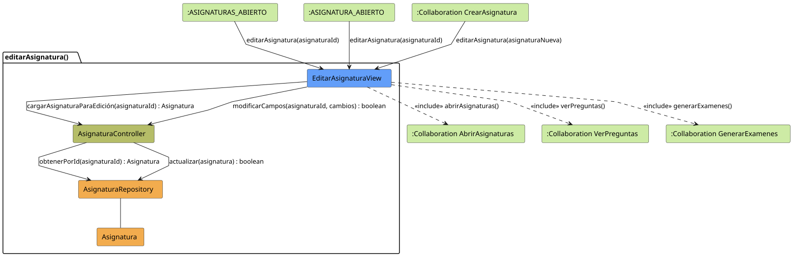 | 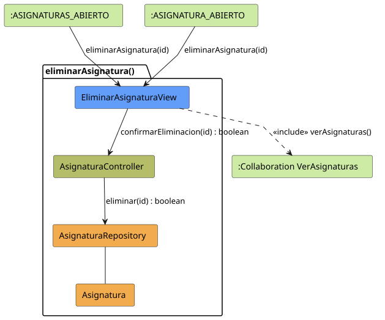 |

---

### 👥 Gestión de Alumnos
Mantenimiento de la base de datos de estudiantes.

| Ver Alumnos | Crear Alumno |
| :---: | :---: |
| 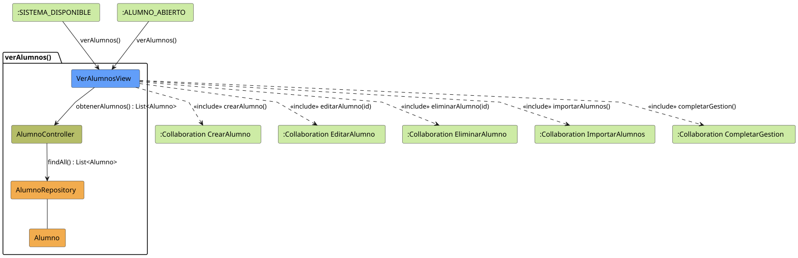 | 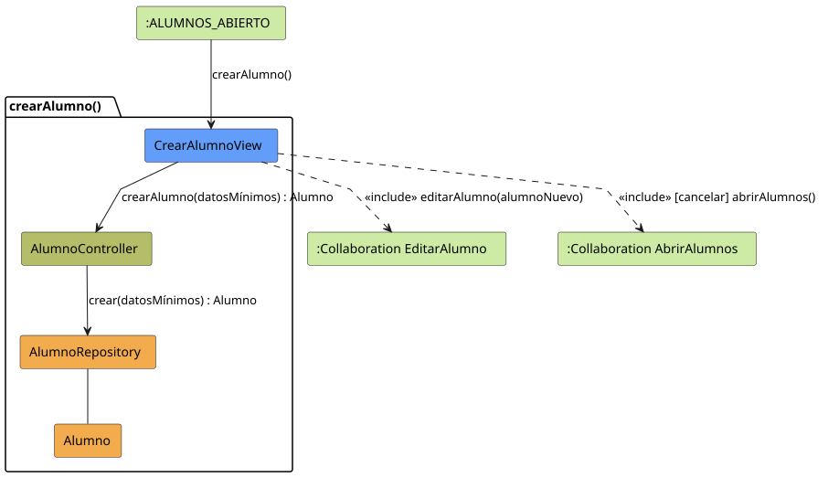 |

| Editar Alumno | Eliminar Alumno |
| :---: | :---: |
|  |  |

---

### ❓ Gestión de Preguntas
Construcción del banco de ítems de evaluación.

| Ver Preguntas | Crear Pregunta |
| :---: | :---: |
|  |  |

| Editar Pregunta | Eliminar Pregunta |
| :---: | :---: |
|  |  |

---

### 📝 Gestión de Respuestas
Definición de las opciones y soluciones para cada pregunta.

| Ver Respuestas | Crear Respuesta |
| :---: | :---: |
|  |  |

| Editar Respuesta | Eliminar Respuesta |
| :---: | :---: |
| 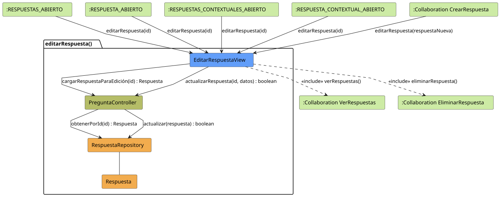 | 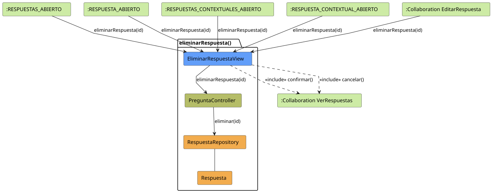 |

---

### 📝 Gestión de Exámenes
Núcleo del sistema para la generación, asignación y corrección.

| Generar Exámenes | Cancelar Generación |
| :---: | :---: |
|  | 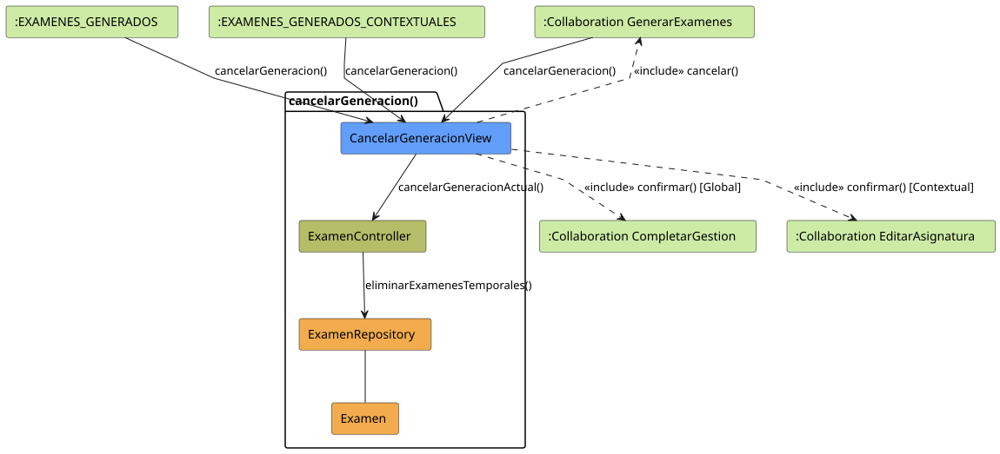 |

| Asignar Exámenes | Corregir Exámenes |
| :---: | :---: |
| 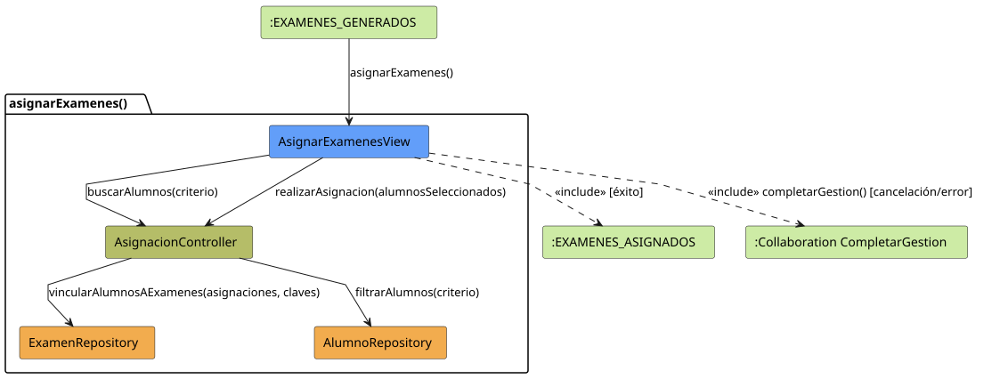 | 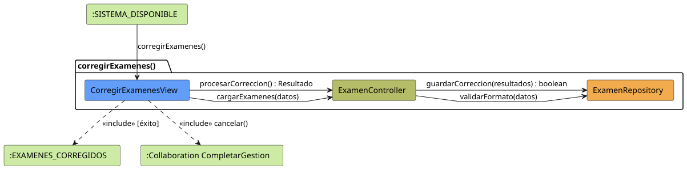 |

---

### ⚙️ Configuración y Sistema
Opciones avanzadas y administración de usuarios (Docentes).

| Ver Docentes | Crear Docente |
| :---: | :---: |
|  |  |

| Editar Docente | Eliminar Docente |
| :---: | :---: |
| 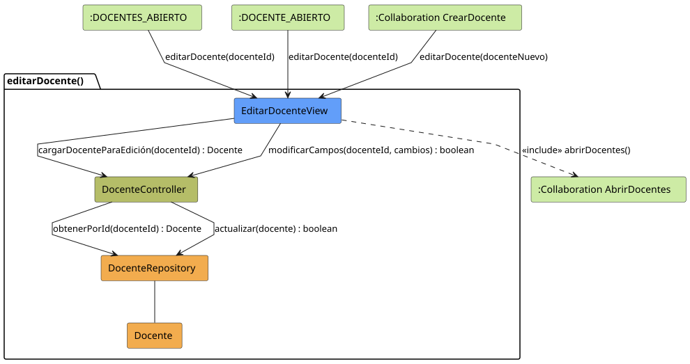 | 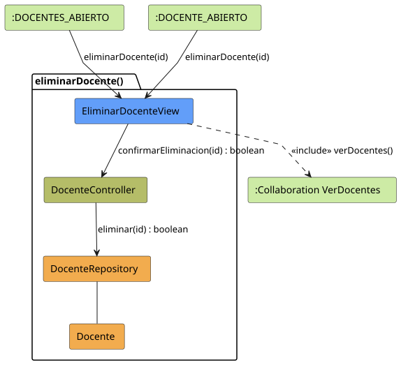 |

| Importar Configuración | Exportar Configuración |
| :---: | :---: |
| 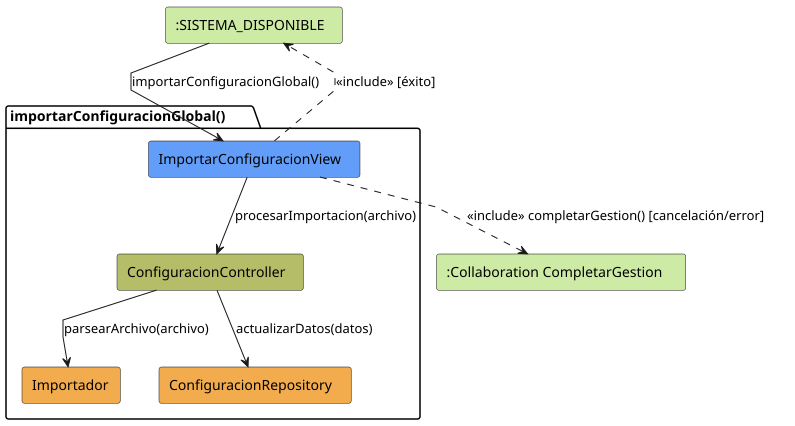 | 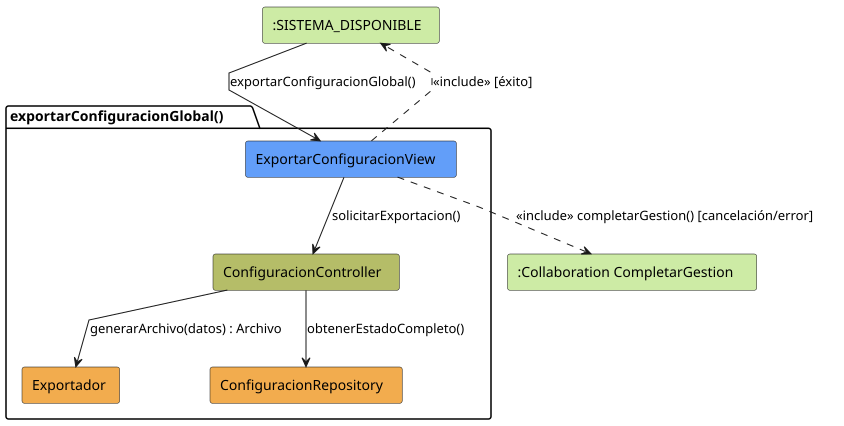 |
