# Documento de Arquitectura y Decisiones Tecnológicas - Jorgestor

---
### 📂 Navegación del Repositorio
[**🏠 Inicio**](../../README.md) | [**🔍 Análisis**](../analisis) | [**💻 Desarrollo**](../../src)
---

Este documento define los cimientos técnicos del sistema **Jorgestor**, asegurando la coherencia entre el análisis, el diseño e implementación final.

## 1. Stack Tecnológico Seleccionado

Se ha optado por una arquitectura de **Single Page Application (SPA)** con una **API REST**, priorizando la separación de responsabilidades, la mantenibilidad y el rigor académico de IDSW2.

### Backend: Java + Spring Boot
- **Framework:** Spring Boot 3.x.
- **Gestor de proyectos:** Maven.
- **Justificación:** Ecosistema robusto, inyección de dependencias (IoC), manejo avanzado de persistencia con Spring Data JPA y seguridad integral con Spring Security. Maven es el estándar de facto para la gestión de dependencias y construcción en entornos Java profesionales.
- **Rol:** Proveedor de servicios REST, orquestador de lógica de negocio y guardián de la integridad de los datos.

### Frontend: React + TypeScript
- **Framework:** React 18+ (Vite).
- **Lenguaje:** TypeScript (Tipado estricto).
- **Estilos:** Tailwind CSS.
- **Justificación:** Tailwind permite un diseño moderno, altamente personalizable y eficiente mediante clases de utilidad, eliminando la necesidad de archivos CSS extensos y facilitando la consistencia visual. Vite proporciona un entorno de desarrollo extremadamente rápido.
- **Rol:** Interfaz de usuario reactiva, gestión de estado en cliente y consumo de la API REST.

### Base de Datos: PostgreSQL + Docker
- **Motor:** PostgreSQL (Relacional).
- **Infraestructura:** Contenedores Docker (Docker Compose).
- **Justificación:** El uso de Docker asegura que el entorno de base de datos sea idéntico para todos los desarrolladores y en cualquier máquina, facilitando el despliegue y cumpliendo con estándares profesionales de "arranque inmediato".
- **ORM:** Hibernate (vía Spring Data JPA).

---

## 2. Decisiones de Diseño Globales

### Comunicación Cliente-Servidor
- **Protocolo:** HTTPS / JSON.
- **Estilo Arquitectónico:** RESTful.
- **Autenticación:** JWT (JSON Web Tokens) para stateless sessions, permitiendo escalabilidad y desacoplamiento.

### Gestión de Errores
- El backend proporcionará códigos de estado HTTP estandarizados (200, 201, 400, 401, 403, 404, 500) junto con un cuerpo de error descriptivo para que el frontend pueda informar correctamente al usuario.

---

## 3. Diagramas de Secuencia (Diseño)

A continuación se detallan las interacciones técnicas entre los componentes del sistema (Frontend, Controller, Service, Repository) para cada caso de uso.

### 🔐 Autenticación y Seguridad

| Inicio de Sesión | Cerrar Sesión |
| :---: | :---: |
| 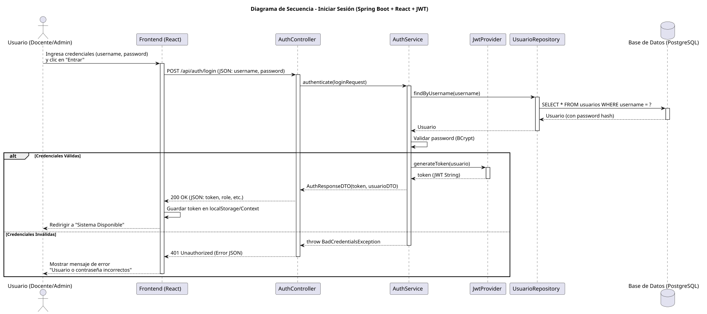 |  |

---

### 📊 Dashboard Dinámico

| Completar Gestión |
| :---: |
|  |

---

### 🎓 Módulo de Grados

| Ver Grados | Crear Grado |
| :---: | :---: |
| 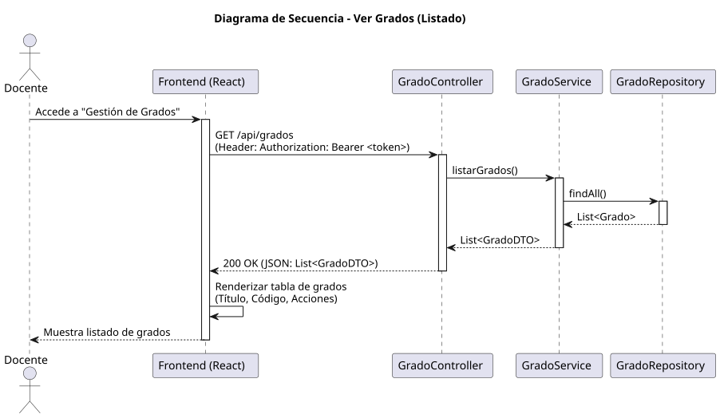 |  |

| Editar Grado | Eliminar Grado |
| :---: | :---: |
|  | 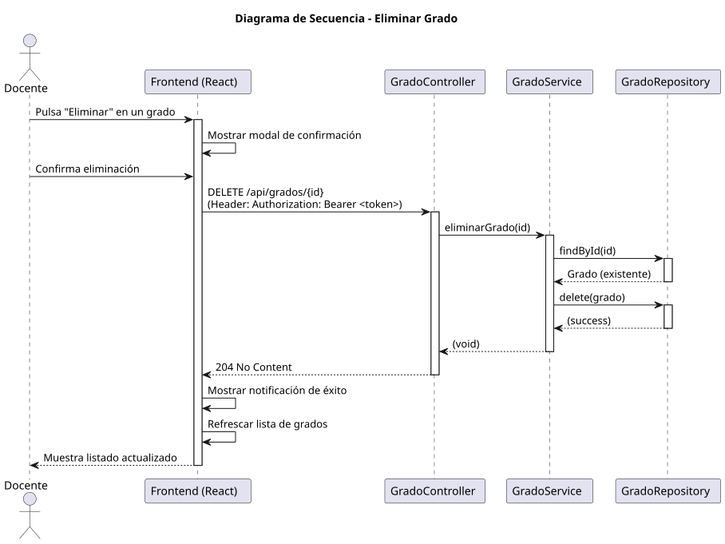 |

---

### 📚 Módulo de Asignaturas

| Ver Asignaturas | Crear Asignatura |
| :---: | :---: |
| 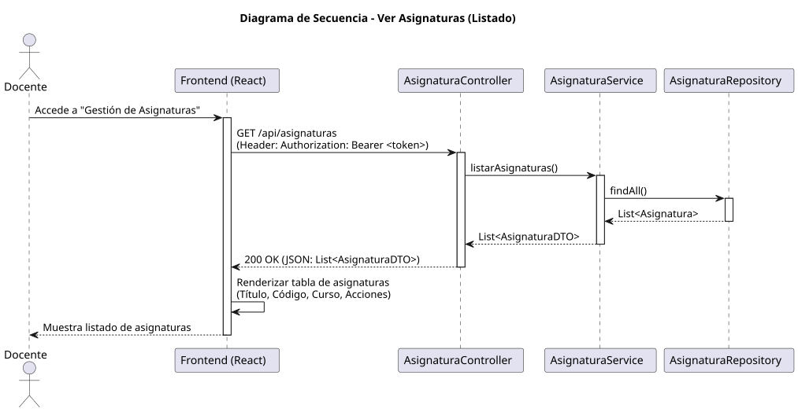 | 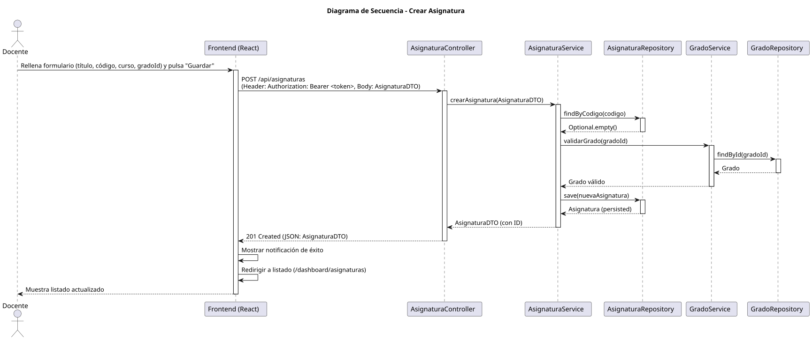 |

| Editar Asignatura | Eliminar Asignatura |
| :---: | :---: |
|  | 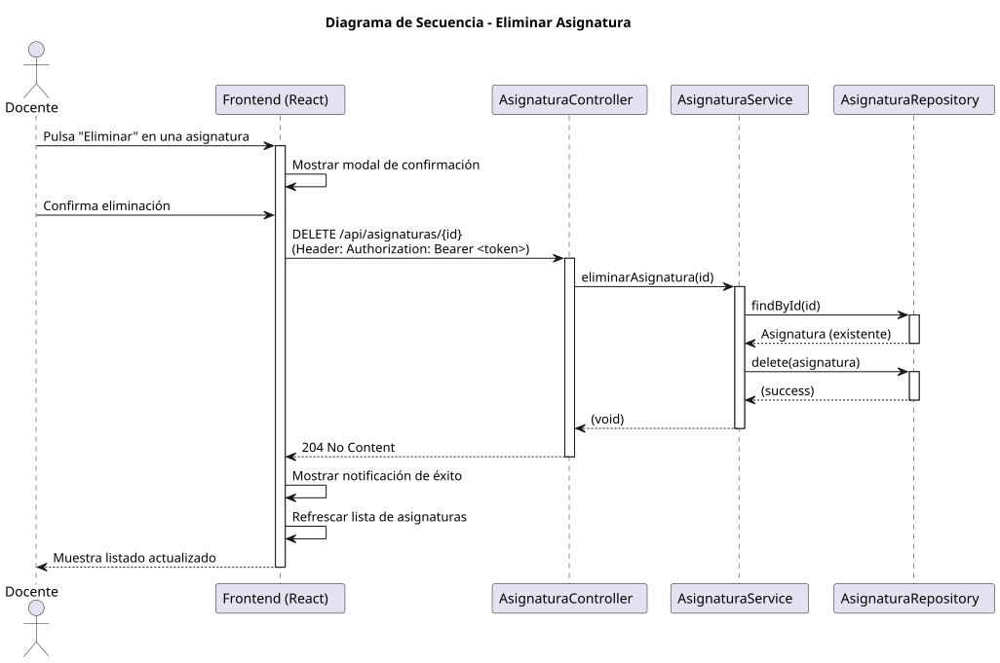 |

---

### 👥 Módulo de Alumnos

| Ver Alumnos | Crear Alumno |
| :---: | :---: |
|  |  |

| Editar Alumno | Eliminar Alumno |
| :---: | :---: |
| 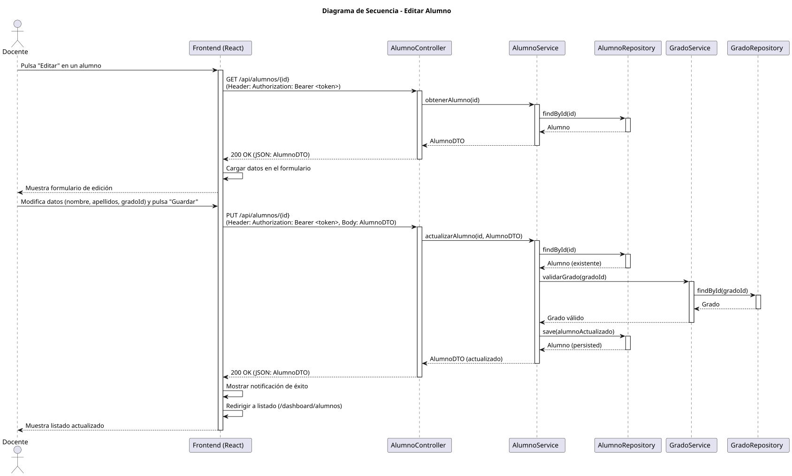 |  |

---

### ❓ Módulo de Preguntas

| Ver Preguntas | Crear Pregunta |
| :---: | :---: |
|  | 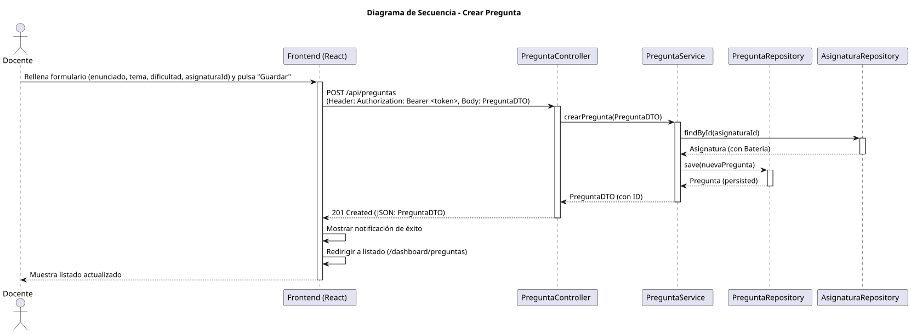 |

| Editar Pregunta | Eliminar Pregunta |
| :---: | :---: |
| 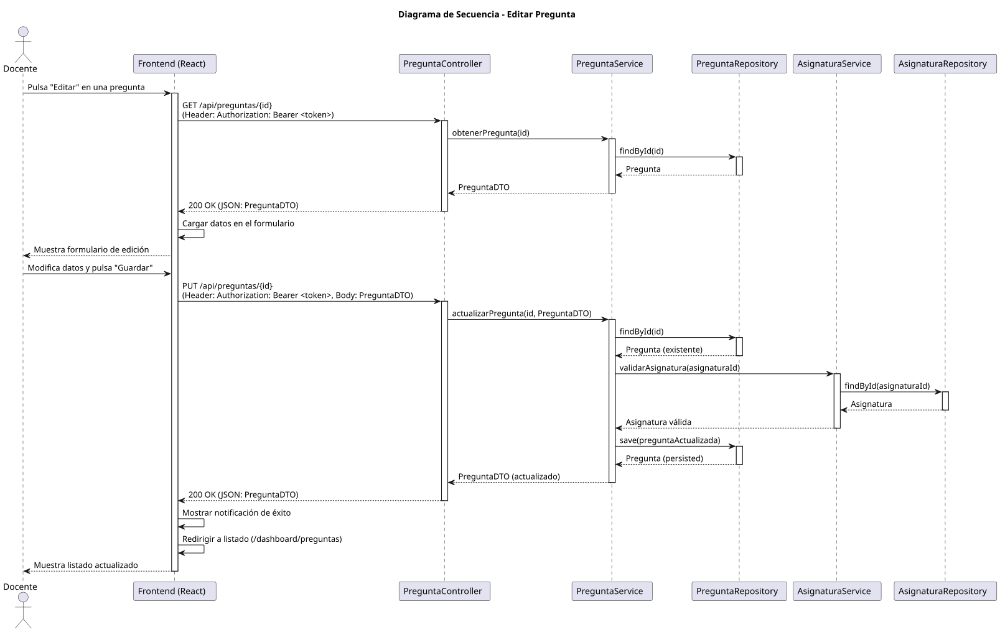 |  |

---

### 📝 Módulo de Respuestas

| Ver Respuestas | Crear Respuesta |
| :---: | :---: |
| 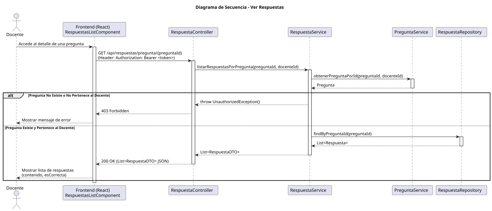 |  |

| Editar Respuesta | Eliminar Respuesta |
| :---: | :---: |
| 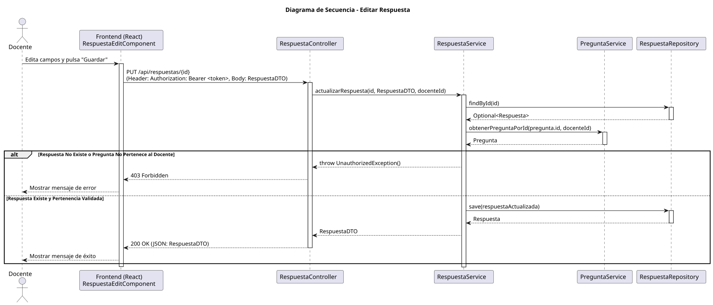 | 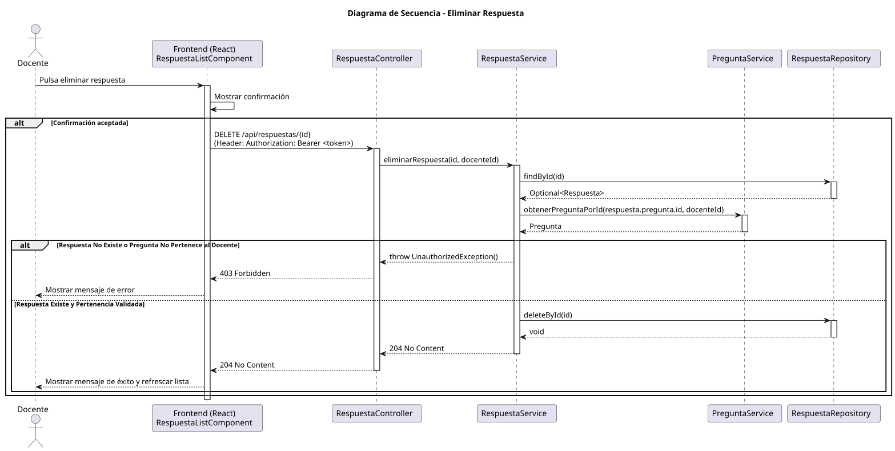 |

---

### 📝 Core de Exámenes

| Generar Exámenes | Cancelar Generación |
| :---: | :---: |
| 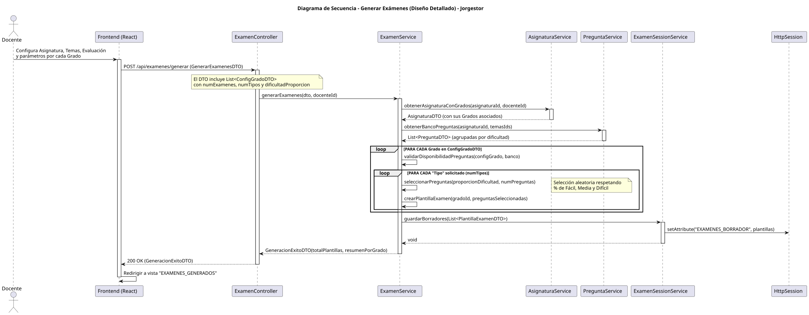 | 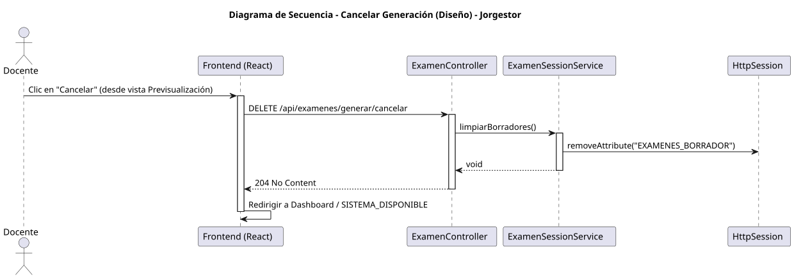 |

| Asignar Exámenes | Corregir Exámenes |
| :---: | :---: |
| 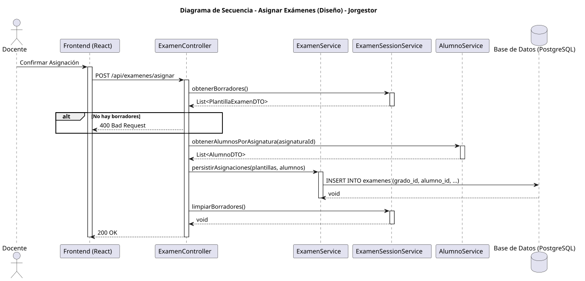 |  |

---

### ⚙️ Mantenimiento de Sistema

| Ver Docentes | Crear Docente |
| :---: | :---: |
|  | 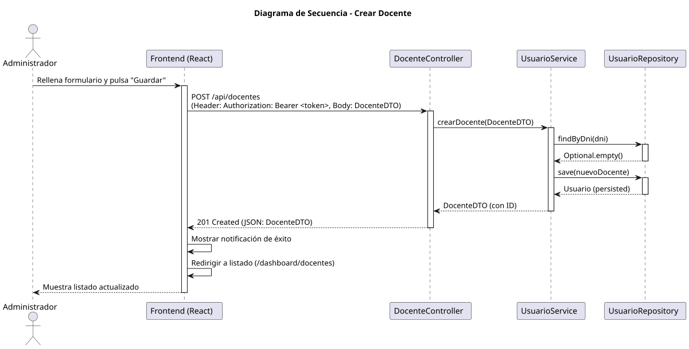 |

| Editar Docente | Eliminar Docente |
| :---: | :---: |
|  |  |

| Importar Configuración | Exportar Configuración |
| :---: | :---: |
|  | 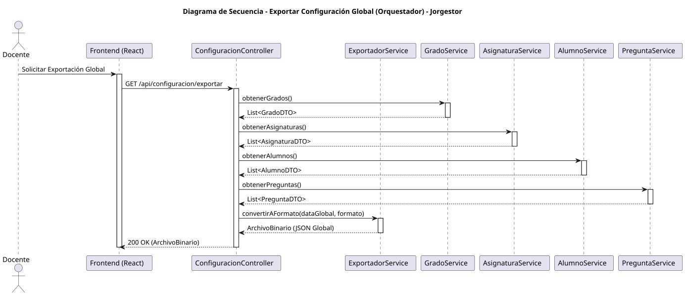 |
